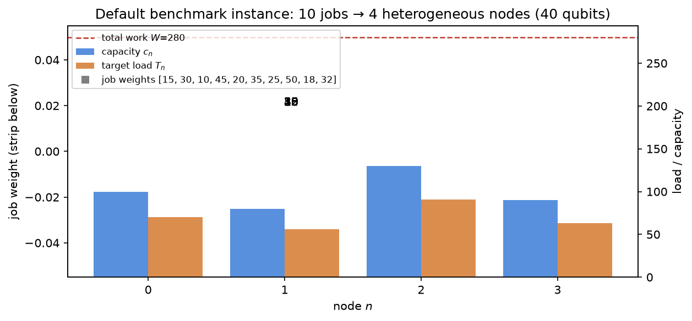
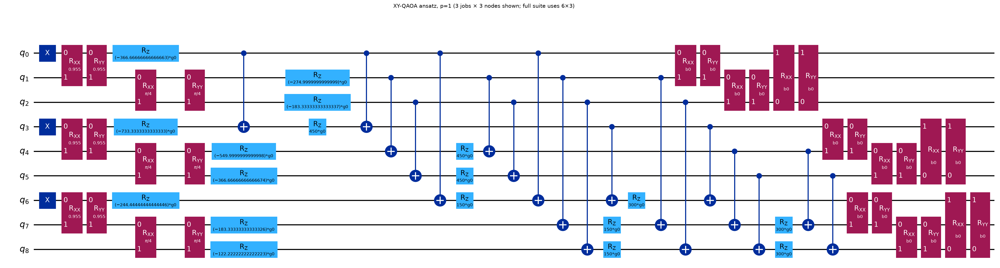
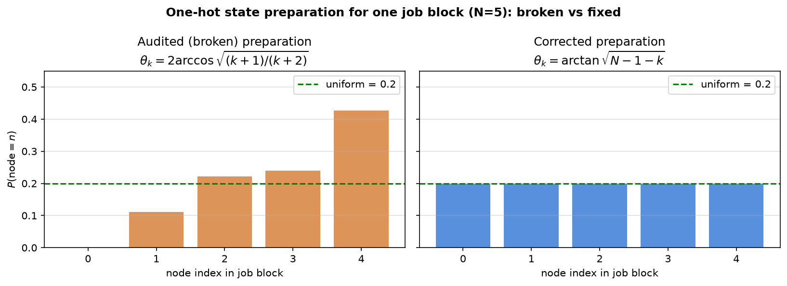
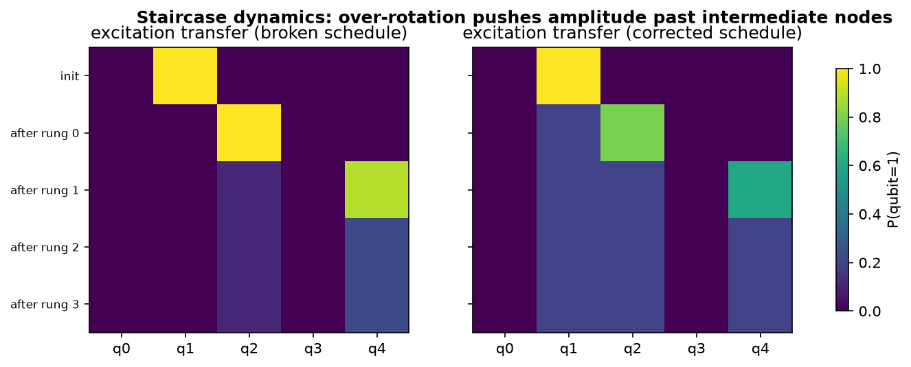
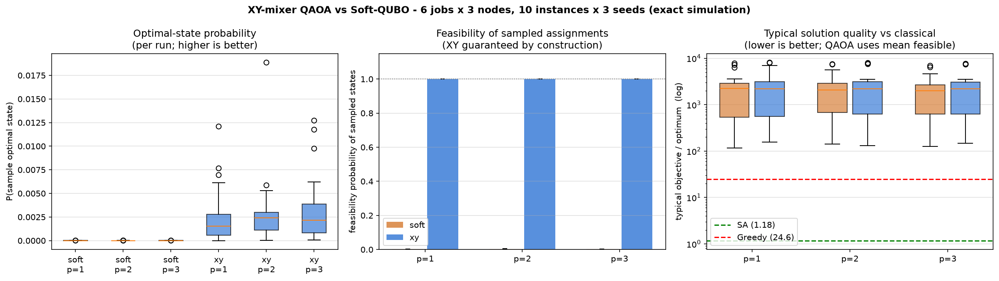
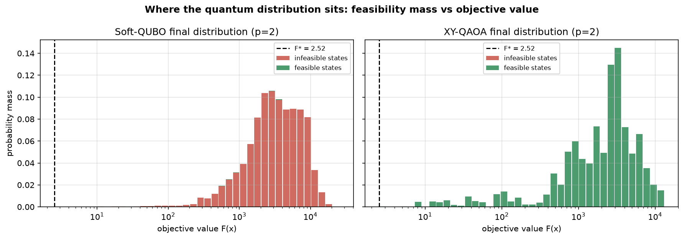
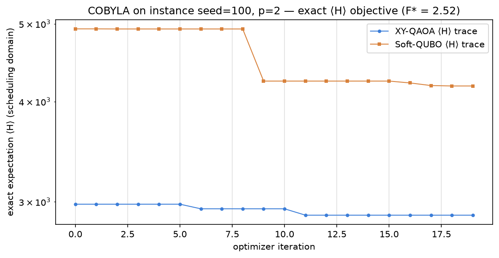
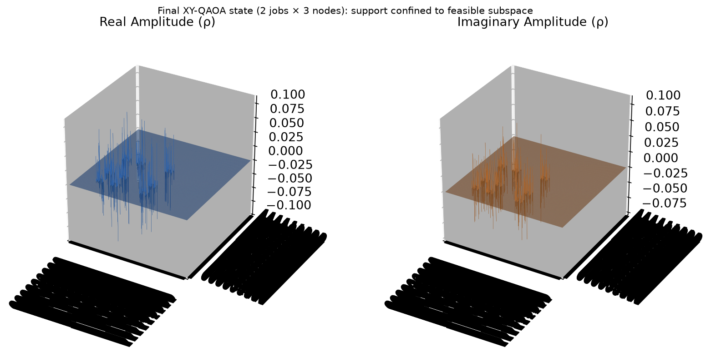
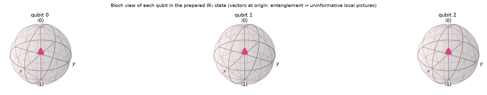
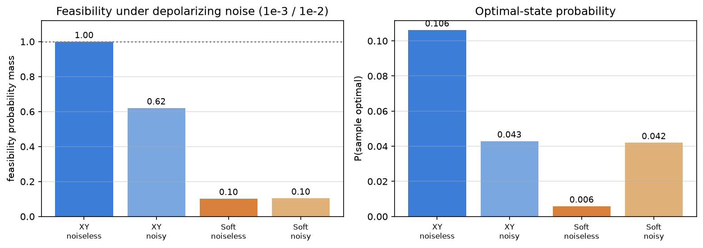

# Quantum vs. Classical HPC Load Balancing — a verified benchmark

**Constraint-preserving XY-mixer QAOA vs. penalty-based Soft-QUBO for HPC job scheduling.**

This is a ground-up rebuild of Team ZETA's hackathon project after a full technical audit (`AUDIT.md`) of the original code. The original headline claims did not survive scrutiny — the benchmark was degenerate, the penalty invalid, the initial state broken, and the results sampling artifacts. Everything here is rebuilt, unit-tested (52 tests), and backed by executed experiments.

> **TL;DR** — XY-QAOA **guarantees feasible schedules by construction** (100% of sampled mass in ideal simulation vs 0.31% for Soft-QUBO), but **neither QAOA variant produces solutions competitive with trivial classical methods**: simulated annealing lands within 18% of the optimum while typical QAOA samples sit ~2000× above it. Depolarizing noise destroys most of XY's feasibility guarantee (100% → 62%). No quantum advantage is demonstrated or claimed.

---

## Contents

1. [The problem](#1-the-problem)
2. [Mathematical formulation](#2-mathematical-formulation)
3. [Two quantum approaches](#3-two-quantum-approaches)
4. [What the audit found](#4-what-the-audit-found)
5. [Methodology & fairness](#5-methodology--fairness)
6. [Results](#6-results)
7. [Noise experiment](#7-noise-experiment)
8. [Repository layout](#8-repository-layout)
9. [Reproduction](#9-reproduction)
10. [Limitations](#10-limitations)

---

## 1. The problem

Assign each of `J` jobs with workload `wⱼ` to one of `N` compute nodes with capacity `cₙ`. Multiple jobs may share a node.



The figure shows the deterministic headline instance used for classical ground truth: **10 jobs × 4 heterogeneous nodes = 40 qubits**, total work W = 280. Node targets are set *proportionally to capacity*, so heterogeneous hardware is respected by construction.

## 2. Mathematical formulation

| Quantity | Definition |
|---|---|
| Variables | `x[j,n] ∈ {0,1}` at qubit `q = j·N + n` |
| Assignment constraint | `Σₙ x[j,n] = 1 ∀j` (the only hard constraint) |
| Node load | `load_n = Σⱼ wⱼ x[j,n]` |
| Target loads | `T_n = κ·cₙ`, `κ = W/Σc` (or `T_n = W/N` without capacities) |
| **Objective** | `F(x) = Σₙ (load_n − Tₙ)²` |
| Capacity diagnostic | `max(0, load_n − cₙ)` — always reported, never hidden |

Why proportional targets instead of hard capacity constraints? `F` is exactly quadratic-binary (a clean QUBO), whereas hinge penalties require slack variables that double the qubit count. Every generated instance is validated so its optimal assignments have zero overload.

**Penalty calibration.** For Soft-QUBO we define `P* = sup { (F*_feasible − F(x)) / V(x) : x infeasible }` and compute it *exactly* by full enumeration (≤26 qubits). Measured on our instances: recommended penalties (=1.1·P\*) range from ~10⁻⁶ to 3.10, i.e. violations are at most marginally attractive under this objective family. **This is empirical and instance-dependent, not a theorem** — the original project's 5×5 formulation required P\* ≈ 200–400, and its P = 120 put the penalized ground state itself on an infeasible schedule.

## 3. Two quantum approaches

| | Soft-QUBO QAOA | XY-QAOA |
|---|---|---|
| Search space | all 2^(J·N) bitstrings | one-hot subspace only (Nᴶ states) |
| Constraint handling | penalty `P·Σⱼ(Σₙx[j,n]−1)²` | none needed — ring XY mixer conserves per-block excitation |
| Initial state | `\|+…+⟩` | uniform superposition over feasible assignments |
| Cost Hamiltonian | Ising(F + P·V) | Ising(F) |
| Mixer | X (`rx(2β)`) | ring `rxx(β)+ryy(β)` per job block |



The XY mixer, Ising coefficient derivation, cost-layer gates, and bit-ordering conventions survived the audit numerically verified-correct and are preserved verbatim in `src/zeta_scheduler/circuits.py` / `ising.py`.

## 4. What the audit found

Full evidence: [`AUDIT.md`](AUDIT.md). Summary of proven flaws in the original project:

| # | Flaw | Evidence |
|---|---|---|
| 1 | 5×5 benchmark degenerate: 120/3125 feasible states "optimal" (all bijections score 770) | exhaustive enumeration |
| 2 | Penalty P=120 invalid: penalized ground state energy 465 < 770, **infeasible** | brute force over all 2²⁵ states |
| 3 | Results were sampling tails: "770" appeared with random parameters 5/5 trials; "3320" was 1 feasible shot out of 1024 | pipeline reproduction |
| 4 | Initial state broken: node 0 received probability exactly 0 | exact statevector |
| 5 | Unfair comparison (8 vs ~600 optimizer evaluations, different objectives/selection rules); wrong constant offset (−8162.5); false depth claim (189 vs actual 63) | code + probes |

Flaw #4 in pictures — the published angle schedule over-rotated every rung (because `RXX(θ)·RYY(θ)` rotates the two-level subspace by the **full** angle θ):





The corrected staircase uses `θ_k = arctan(√(N−1−k))` — uniform to <10⁻⁹ with zero leakage, unit-tested for N = 2…8.

## 5. Methodology & fairness

Everything is seeded and configurable via CLI. Enforced in code:

- same instances (validated non-degenerate + capacity-feasible optimum), depths, parameter counts (2p), init policy, seeds, COBYLA budget, restarts;
- optimizer objective = **exact expectation ⟨H⟩** from the full distribution — never a sample-min statistic;
- final metrics from the same full distribution under one selection rule for both methods;
- classical baselines optimize/score the identical objective; the random baseline samples uniformly over **feasible assignments only**.

Headline suite: **180 runs = 10 instances × 3 seeds × depths {1,2,3} × 2 methods**, exact noiseless simulation at 18 qubits.

Metric definitions (used consistently everywhere):

- *Feasibility* = probability mass the final distribution places on feasible bitstrings (**not** the fraction of bitstrings — that would be 0.28%, coincidentally close to Soft-QUBO's 0.31%);
- *P(optimal)* = probability mass on optimal assignments, averaged over runs;
- *Typical quality* = mean objective over feasible-support states, compared to F\* both as ratio and absolute gap;
- distributions are exact (infinite-shot limit), not finite samples.

## 6. Results

### 6.1 Default instance (10×4, classical)

Non-degenerate: **13,365 unique objective values** across 1,048,576 feasible assignments; optimum reached by only 12 (0.0011%).

| Method | Objective | Ratio to optimum |
|---|---|---|
| Exact enumeration | **2.00** | 1.00 |
| Simulated annealing | 6.00 | 3.00 |
| Random best-of-20k | 14.00 | 7.00 |
| Greedy (LPT) | 422.00 | 211.0 |

### 6.2 Statistical suite (180 runs)

| Metric (mean over runs) | Soft-QUBO | XY-QAOA |
|---|---|---|
| Feasibility probability | **0.31 %** (range 0.10–0.66 %) | **100 %** (min ≥ 1−10⁻¹⁴) |
| P(sample optimal), p=1 / 2 / 3 | 8 / 4 / 5 ×10⁻⁶ | 0.23 % / 0.28 % / 0.30 % |
| Mean sampled feasible objective, p=2 | 2846 | 2959 |
| Per-run ratio mean-feasible/F\* (median, p=2) | 2074 | 2219 |
| Absolute gap (p=2, avg) | 2841 units | 2954 units |
| Optimizer evaluations, p=1/2/3 | 26 / 40 / 55 | 27 / 39 / 54 |

Classical baselines on the same 10 instances:

| Baseline | mean ratio to optimum | notes |
|---|---|---|
| Simulated annealing | **1.18** | exact optimum on 9/10 instances |
| Random best-of-10k | **1.00** | finds the exact optimum on 10/10 |
| Greedy (LPT) | 24.6 | poor on imbalance objectives |

Distributions across all 180 runs:



### 6.3 Where the quantum distribution actually sits



Left: Soft-QUBO's final distribution sits almost entirely on **infeasible** states (red). Right: XY's sits entirely on **feasible** ones (green) — but note both peaks lie far above F\*. Feasibility ≠ optimality.

Convergence under the exact expectation objective:



### 6.4 What the states look like

State-city of a final XY-QAOA state (6 qubits → 64 amplitudes): support confined to the feasible subspace.



Bloch view of each qubit in a prepared W₃ state — the vectors sit at the origin because entanglement makes single-qubit pictures uninformative (shown for honesty about what a Bloch sphere can and cannot show here):



### 6.5 Honest reading

1. **Feasibility is XY's real advantage** — structural, ideal-simulation-only: 100 % vs 0.31 % probability mass.
2. **Neither QAOA variant is competitive on solution quality**: typical samples are ~2000× above the optimum (absolute gaps ≈ 2700–3000 units vs F\*≈4.7 average); SA is within 18%; uniform random best-of-10k found the exact optimum on every instance.
3. XY's typical quality is slightly **worse** than Soft's (median ratio 2219 vs 2074 at p=2); XY wins on feasibility mass and P(optimal), not quality.
4. Depth helps marginally (P(optimal): 0.23 % → 0.30 % from p=1→3).
5. "Best found" metrics saturate at ratio 1.0 for both methods (verified mean = 1.000 over 180 runs) — optimal states almost always carry nonzero probability in exact distributions, which is why we report mass and typicality instead of tails.

## 7. Noise experiment

Depolarizing noise (p₁=10⁻³, p₂=10⁻²), 4×2 instance, p=1 (`results/noise_experiment.json`):



| Condition | Feasibility | P(optimal) |
|---|---|---|
| XY noiseless | 1.000 | 0.106 |
| **XY noisy** | **0.621** | 0.043 |
| Soft noiseless | 0.103 | 0.006 |
| Soft noisy | 0.105 | 0.042 |

**Noise destroys part of XY's feasibility guarantee**: depolarizing errors do not respect the constraint manifold. Any hardware claim would require error mitigation; none is made.

## 8. Repository layout

```
src/zeta_scheduler/    problem, objective, exact solver, classical baselines,
                       QUBO + penalty calibration, Ising, circuits, QAOA,
                       evaluation, benchmark  (11 modules, fully tested)
tests/                 52 tests covering all validation gates
scripts/
    run_benchmark.py   configurable CLI benchmark (--smoke … --workers)
    run_noise.py       depolarizing-noise experiment
    plot_results.py    statistical plots from benchmark CSV
    make_figures.py    all README figures
results/               CSVs, summary JSONs, figures, noise JSON
notebooks/             original audited hackathon notebooks (historical)
AUDIT.md               full technical audit with numerical evidence
REBUILD_REPORT.md      rebuild decisions, gates, artifacts
```

## 9. Reproduction

```bash
pip install -e .
python -m pytest tests -q                        # validation gates (~1.5 min)
python scripts/run_benchmark.py --smoke          # end-to-end sanity
python scripts/run_benchmark.py                  # 180-run statistical suite
python scripts/run_noise.py                      # depolarizing-noise experiment
python scripts/make_figures.py                   # regenerate README figures
```

Environment: Python 3.11, Qiskit 2.5, Aer 0.17 (`requirements.txt`). All randomness seeded; reruns reproduce the CSVs.

## 10. Limitations

- **Small sizes**: exact-statevector QAOA limits executed suites to ~18 qubits; the 40-qubit default instance is characterized classically only.
- **Simulation-based results** throughout; generic depolarizing noise, no device calibration, no hardware execution.
- **Classical methods strongly outperform both QAOA variants** on solution quality at every scale tested.
- **Noise removes part of XY's guarantee** (100 % → 62 %).
- **No quantum advantage demonstrated or claimed** — in quality, runtime, or scalability.
- Capacities handled via proportional targets + diagnostics (QUBO-cleanliness tradeoff, documented).
- Exact penalty calibration needs 2^Q enumeration (≤ ~26 qubits); COBYLA converges early (~27–55 evals); advanced variants (warm start, CVaR, ma-QAOA) deliberately deferred.

---

*Provenance:* built on Team ZETA's Mini Alexandria Quantum Hackathon project (May 2026); audited originals preserved in `notebooks/`. Every retained component is listed with its verification test; everything else was rewritten.
